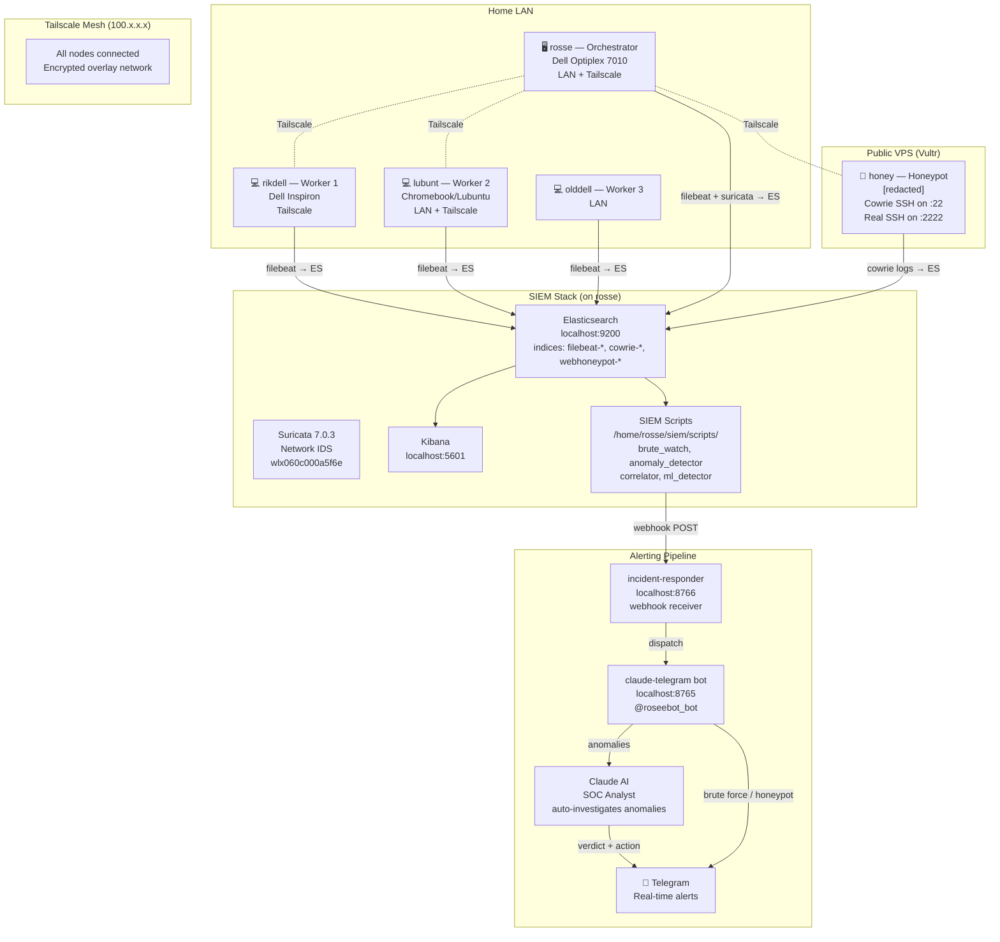

# Homelab SIEM — Architecture

## Cluster Overview



## Data Flow

```
Internet → [attack]
              │
    ┌─────────┴──────────────────────┐
    │                                │
🍯 Honeypot (honey)          🖥️ Cluster nodes
Cowrie catches sessions       Fail2ban + iptables
    │                                │
    └──────────┬─────────────────────┘
               │
          Filebeat ships logs
               │
               ▼
      Elasticsearch (rosse:9200)
               │
        ┌──────┴───────┐
        │              │
     Kibana         SIEM Scripts
   (dashboards)   (cron every 5–60m)
                       │
                 Webhook → incident-responder
                       │
               claude-telegram bot
                  /         \
           SSH brute       SIEM anomaly
           (direct TG)    (→ Claude AI)
                                │
                         Investigation +
                         auto-block if warranted
                                │
                         📱 Telegram report
```

## Node Roles

| Node    | Role            | Key Services                                                            |
|---------|-----------------|-------------------------------------------------------------------------|
| rosse   | Orchestrator    | ES, Kibana, Suricata, SIEM scripts, claude-telegram, incident-responder |
| rikdell | Swarm Worker 1  | Docker Swarm, Filebeat, Fail2ban                                        |
| lubunt  | Swarm Worker 2  | Docker Swarm, Filebeat, Fail2ban                                        |
| olddell | Swarm Worker 3  | Docker Swarm, Filebeat                                                  |
| honey   | Honeypot VPS    | Cowrie SSH, web honeypot                                                |

## Detection Layers

| Layer | Tool | What it catches |
|-------|------|-----------------|
| Network | Suricata | Malicious traffic, C2 beacons, port scans |
| Auth | Fail2ban | SSH brute force on worker nodes |
| Log correlation | brute_watch.py | Multi-node SSH attacks |
| Behavioral | anomaly_detector.py | Unusual login patterns, new services |
| ML | ml_detector.py | IsolationForest + LOF ensemble anomalies |
| Honeypot | Cowrie + cowrie_alerter.py | Attacker TTPs, credential spray lists |
| Threat intel | ThreatFox / Feodo | Known malware C2 IPs |
